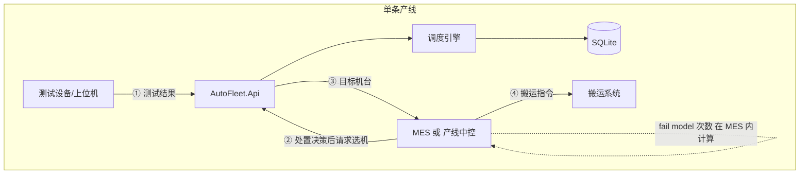
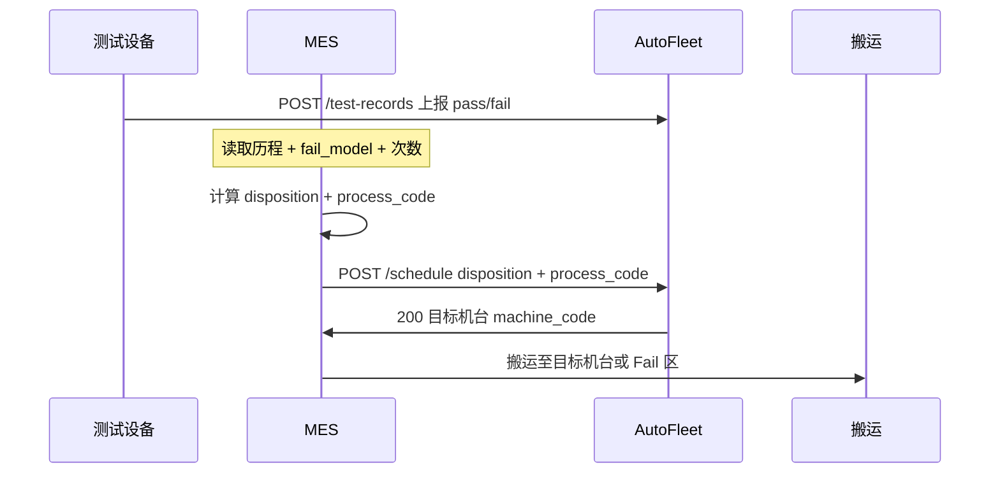

# AutoFleet 与 MES 对接说明

> 定义 MES、测试设备、搬运系统与 AutoFleet 之间的职责边界与 HTTP 接口约定  
> 配套：[设计手册](./设计手册.md)、[架构介绍](./架构介绍.md)、[策略配置指南](./策略配置指南.md)

---

## 1. 对接全景



**核心原则：**

- **合格 / 不合格、复测还是报废** → **MES**（依据 fail model、已测次数、工艺规则）
- **在已定路由下选哪台机台** → **AutoFleet**（依据配置规则与标签打分）
- AutoFleet **不**实现 fail model，**不**决定 `disposition`

---

## 2. 系统职责矩阵

| 系统 | 负责 | 不负责 |
|------|------|--------|
| **测试设备** | 单次 pass/fail、`fail_type`（技术分类）、实测数据 | 路由、选机、复测次数判定 |
| **MES** | fail model 与复测上限；计算 **disposition**；调用调度；下发搬运 | 机台打分、标签权重 |
| **AutoFleet** | 接收 disposition + process_code；匹配规则；选机；日志 | 合格判定、报废判定、fail 次数逻辑 |
| **搬运系统** | 执行物理搬运；可选回执占用/到位 | 选机策略 |

---

## 3. 两个关键概念

### 3.1 测试结果（事实）

由测试设备上报，写入 `product_test_history`，描述「测出来怎样」：

| 字段 | 示例 | 说明 |
|------|------|------|
| test_result | pass / fail | 当次判定 |
| fail_type | 项点不良、通信异常 | **技术分类**，不是处置结论 |
| process_code | A | 在哪道工序测的 |
| machine_code | M-A-01 | 在哪台机测的 |

> `fail_type` **不应**包含「直接报废」——报废是 MES 处置，不是仪器测量值。

### 3.2 处置 / 路由（MES 决策）

由 MES 在调用调度前确定，通过 **`disposition`** + **`process_code`** 传入 AutoFleet：

| disposition | 含义 | process_code | 典型前置条件（MES 内） |
|-------------|------|--------------|------------------------|
| `first_test` | 首测进站 | A | 无 A 工序有效历程 |
| `pass_to_b` | A 通过，流转 B | B | 最近一次 A 为 pass |
| `fail_retest` | A fail，允许复测 | A | fail 且 次数 &lt; max_retest |
| `fail_scrap` | A fail，判定报废 | FAIL | fail 且 次数 ≥ max_retest 或模型不允许复测 |

**MES 内部逻辑示意（不在 AutoFleet 实现）：**

```
输入: product_sn, fail_model, A工序fail次数, 最近一次test_result
若 last_result = pass     → disposition=pass_to_b,   process=B
若 last_result = fail:
    若 fail_count < max_retest → disposition=fail_retest, process=A
    否则                     → disposition=fail_scrap,  process=FAIL
若无历程                    → disposition=first_test,  process=A
```

AutoFleet 对 `disposition` 与 `process_code` 做**一致性校验**（可选），但**不重新计算**。

---

## 4. 接口服务划分

AutoFleet 对外提供 **数据同步类** 与 **调度类** 接口，MES 为调度类的主要调用方。

| 接口类型 | 调用方 | AutoFleet 行为 |
|----------|--------|----------------|
| 测试历程写入 | 测试设备 / MES 转发 | 异步写库 |
| 机台状态同步 | MES / 机台软件 | 异步写库，更新调度视图 |
| **调度选机** | **MES** | 读库 + 规则匹配 + 返回机台 |
| 健康检查 | 运维 / MES | 探活 |

**时序（A 工序测完后的标准路径）：**



> 若 MES 先聚合测试数据再转发，步骤 1 也可由 MES 调用 `POST /test-records`，测试设备不直连 AutoFleet。

---

## 5. HTTP 接口约定

基础路径：`/api`（单线单实例，无需线体 ID；多线则每线独立部署 + 独立 base URL）。

### 5.1 上报测试结果

```
POST /api/products/{productSn}/test-records
```

**请求体：**

```json
{
  "process_code": "A",
  "machine_code": "M-A-02",
  "test_result": "fail",
  "fail_type": "项点不良",
  "test_time": "2026-06-09T14:30:00",
  "source": "Tester-A01"
}
```

| 字段 | 必填 | 说明 |
|------|------|------|
| test_result | 是 | `pass` / `fail` |
| fail_type | fail 时建议 | 技术分类，供 AutoFleet **复测选机**偏好 |
| process_code | 是 | 本次测试工序 |
| machine_code | 是 | 本次测试机台 |

**响应：** `201 Created` + 记录 ID

---

### 5.2 机台状态同步

```
PUT /api/machines/{machineCode}/status
```

```json
{
  "status": 1,
  "source": "MES",
  "timestamp": "2026-06-09T14:30:00"
}
```

| status | 含义 |
|--------|------|
| 0 | 离线 |
| 1 | 在线 |
| 2 | 维护中 |

---

### 5.3 调度选机（MES 核心调用）

```
POST /api/schedule
```

**请求体：**

```json
{
  "product_sn": "SN-20001",
  "process_code": "A",
  "disposition": "fail_retest",
  "instrument_type": "K0000",
  "request_id": "550e8400-e29b-41d4-a716-446655440000"
}
```

| 字段 | 必填 | 说明 |
|------|------|------|
| product_sn | 是 | 产品 SN |
| process_code | 是 | **下一工序**：`A` / `B` / `FAIL`，由 MES 决定 |
| disposition | 是 | **处置码**，见 §3.2，由 MES 决定 |
| instrument_type | 是 | 产品 DCA，如 K0000、A0001 |
| request_id | 建议 | 幂等键，重复请求返回相同结果 |

**成功响应 `200`：**

```json
{
  "success": true,
  "product_sn": "SN-20001",
  "process_code": "A",
  "disposition": "fail_retest",
  "target_machine_code": "M-A-01",
  "target_machine_name": "A线-K0000-高良率",
  "matched_rule_code": "RULE-A-FAIL-RETEST",
  "score_detail": { }
}
```

**失败响应示例：**

| HTTP | 场景 |
|------|------|
| 404 | 无匹配规则 |
| 409 | disposition 与 process_code 组合不合法 |
| 503 | 目标工序无在线机台 |

---

### 5.4 disposition 与 process_code 合法组合

| disposition | 允许的 process_code |
|-------------|---------------------|
| first_test | A |
| pass_to_b | B |
| fail_retest | A |
| fail_scrap | FAIL |

AutoFleet 可在 API 层做校验；**不参与**如何从 fail 推到 fail_scrap 的计算。

---

### 5.5 健康检查

```
GET /api/health
```

返回 `200` 表示服务与数据库可用。

---

## 6. AutoFleet 内部分工（概念服务）

正式实现时，Api 层背后可按职责拆为以下**逻辑服务**（同一进程内，不必独立微服务）：

| 服务 | 职责 |
|------|------|
| **TestRecordIngestService** | 接收测试上报，写 `product_test_history` |
| **MachineStatusSyncService** | 合并多来源机台状态，维护调度视图 |
| **ScheduleService** | 接收 MES 调度请求，编排引擎，写 `schedule_log` |
| **SchedulingEngine** | 构建上下文、规则匹配、候选过滤、打分 |
| **RuleConfigService** | WPF 维护规则/标签（与 MES 无关） |

MES **仅直接调用** `ScheduleService` 暴露的 HTTP；测试上报可由 MES 或设备调用。

---

## 7. 规则匹配与 disposition 的关系

AutoFleet 规则触发应 **以 disposition 为主**，`fail_type` 仅用于 **fail_retest 下的选机偏好**：

| disposition | process | 规则用途 | fail_type 作用 |
|-------------|---------|----------|----------------|
| first_test | A | 首测选机 | 无 |
| pass_to_b | B | B 线 DCA 匹配 | 无 |
| fail_retest | A | A 线复测选机 | 细分：项点不良 / 通信异常 |
| fail_scrap | FAIL | Fail 区选机 | 无（不参与路由） |

**目标规则触发示例：**

```json
{
  "logic": "AND",
  "conditions": [
    { "field": "disposition", "op": "eq", "value": "fail_retest" },
    { "field": "current_process", "op": "eq", "value": "A" }
  ]
}
```

---

## 8. 与当前 Demo 的差异

| 项 | 当前 Demo | 目标（正式 + 文档） |
|----|-----------|---------------------|
| 路由决策 | 场景下拉模拟 MES 输出 | MES 传 `disposition` + `process_code` |
| 报废 | 历程 `fail_type=直接报废` | 仅 `disposition=fail_scrap`，历程 fail_type 为技术类 |
| ScheduleRequest | 仅 SN + process | 增加 disposition、instrument_type |
| 规则 | 部分依赖 fail_type 路由 | 路由看 disposition；fail_type 只影响 A 线打分 |

Demo 场景下拉 = **模拟 MES 已完成的处置**；后续代码重构见 [开发计划](./开发计划.md) M3/M4。

---

## 9. MES 侧需提供的配置（不在 AutoFleet）

建议在 MES 维护，AutoFleet 不存或只读展示：

| 配置 | 说明 |
|------|------|
| fail_model | 产品型号 / DCA 对应的复测策略 |
| max_retest_on_a | A 工序最大 fail 复测次数 |
| instrument_type | 产品 DCA，或由 SN 查 BOM |

---

## 10. 联调检查清单

- [ ] A pass 后 MES 传 `disposition=pass_to_b`, `process_code=B`
- [ ] A fail 未超限 MES 传 `fail_retest`, `process_code=A`
- [ ] A fail 超限 MES 传 `fail_scrap`, `process_code=FAIL`
- [ ] 测试上报 fail_type 仅为技术分类
- [ ] 同一 request_id 重复调用返回相同机台
- [ ] 调度失败时 MES 有降级策略（人工 / 默认 Fail 区）

---

## 11. 相关文档

- [设计手册 §7](./设计手册.md) — 集成与 API 摘要
- [策略配置指南](./策略配置指南.md) — 规则与 disposition
- [Demo 说明](./demo.md) — PoC 场景

---

*文档版本：v1.0 | MES 负责处置，AutoFleet 负责选机*
