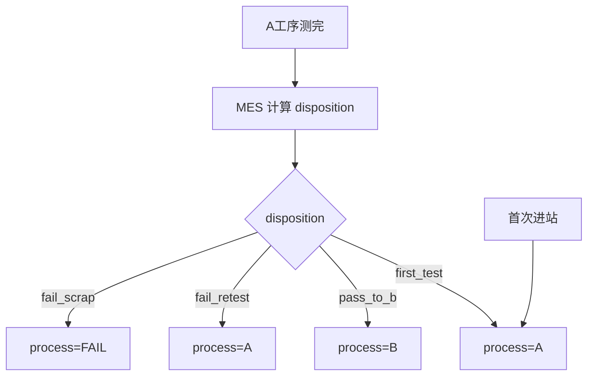

# AutoFleet WinForms Demo

> 场景驱动的调度 PoC，验证 [设计手册](设计手册.md) 核心逻辑。  
> 策略细节见 [策略配置指南](策略配置指南.md)。  
> 正式 MES 对接见 [MES对接说明](MES对接说明.md)。

## 目标

- 用户只选 **「A 测完后发生什么」**，不手选目标工序
- **场景下拉 = 模拟 MES 已算好的 disposition + process_code**
- 系统在已定路由下选机（A / B / FAIL）
- **直接报废**仍调度到 Fail 区，不跳过

## 核心流程



Demo 跳过 MES 计算步骤，场景预设 disposition 等价结果。

## 场景清单

| 场景 | disposition（概念） | 下一工序 | 预期机台 |
|------|---------------------|----------|----------|
| 1 · 首次进A（K0000） | first_test | A | M-A-02 |
| 2 · A通过 → 去B（A0001） | pass_to_b | B | M-B-01 |
| 3 · A失败 → 复测A（项点不良） | fail_retest | A | M-A-01 |
| 4 · A失败 → 换机复测A（通信异常） | fail_retest | A | M-A-02 |
| 5 · A失败 → 去Fail区（直接报废） | fail_scrap | FAIL | M-FAIL-01 |
| 6 · A通过 → 去B（K0000） | pass_to_b | B | M-B-02 |

## 项目结构

```
src/AutoFleet.Demo/
├── Models/          # DemoScenario 等
├── Data/SeedData.cs # 机台、标签、规则、历程、场景
├── Services/        # SchedulingEngine
└── MainForm.cs
```

## 运行

```powershell
cd "D:\Code Github\AutoFleet"
dotnet run --project src/AutoFleet.Demo
```

## 验收

1. 界面仅 **场景下拉 + 执行调度**
2. 六个场景结果与上表一致
3. `dotnet build` 通过

## 与正式项目

Demo 中 `Models/`、`Services/` 计划迁移至 `AutoFleet.Domain` / `AutoFleet.Application`。正式 UI 为 WPF，见 [开发计划](开发计划.md)。

## 相关文档

- [MES对接说明](MES对接说明.md)
- [策略配置指南](策略配置指南.md)
- [架构介绍](架构介绍.md)
- [src/AutoFleet.Demo/README.md](../src/AutoFleet.Demo/README.md)
