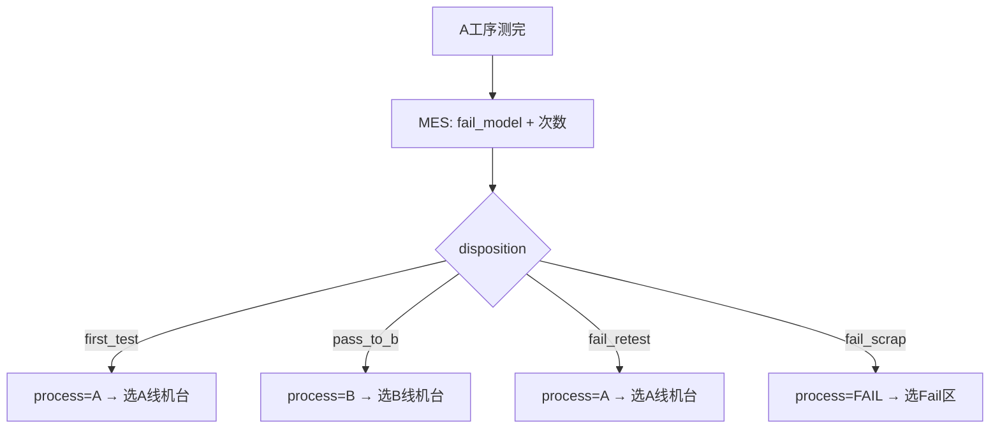
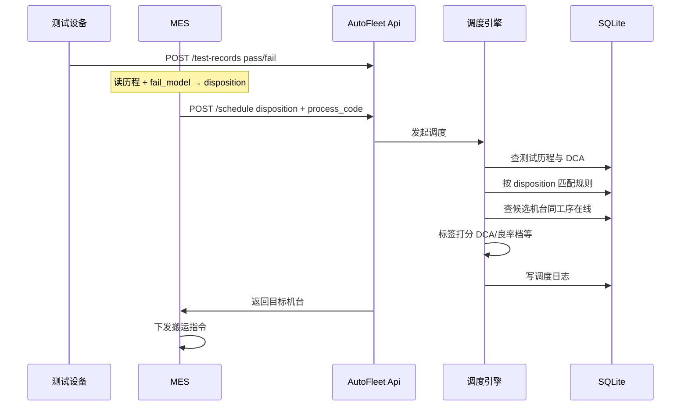

# AutoFleet 架构介绍

> 一页读懂：AutoFleet 是什么、怎么部署、A 测完后怎么分流

---

## 是什么

**AutoFleet** 是面向自动化产线的**柔性机台调度服务**。

当 **A 工序测完成** 后，**MES** 根据 fail model 与复测次数决定 **disposition**（首测 / 流转 B / 复测 / 报废）及 **下一工序**，再调用 AutoFleet。AutoFleet 会：

1. 接收 MES 传入的 `disposition` + `process_code`
2. 查看该产品的测试历程与 DCA 类型
3. 匹配调度规则，在对应工序的在线机台中打分选优
4. 返回目标机台，并记录完整决策过程

**一句话：MES 决定「去哪条路由」，AutoFleet 决定「这条路由上选哪台机」。**

> 当前已有 **WinForms Demo**（[`demo.md`](./demo.md)）验证核心调度逻辑；正式系统 UI 为 WPF，引擎与 Demo 同源迁移。

---

## A 测完后的产线路由

**路由与处置由 MES 负责**；AutoFleet 只接收结果并选机。详见 [MES对接说明](./MES对接说明.md)。



| disposition | 含义 | 下一工序 | AutoFleet 职责 |
|-------------|------|----------|----------------|
| first_test | 首测进站 | A | 在 A 线选机 |
| pass_to_b | A 通过 | B | 在 B 线选机 |
| fail_retest | A fail 可复测 | A | 在 A 线选机（fail_type 影响偏好） |
| fail_scrap | A fail 报废 | FAIL | 在 Fail 区选机 |

---

## 部署方式

采用 **单线单库**：每条产线独立部署，互不干扰。

```
┌──────────────── 产线 A ────────────────┐
│  搬运/MES ──→ AutoFleet ──→ SQLite    │
│                  ↑                    │
│              WPF 配置/监控             │
└──────────────────────────────────────┘
```

| 特点 | 说明 |
|------|------|
| 一条线一个库 | 备份、排错、升级互不影响 |
| 规则各线自定 | 不必强行统一策略 |
| 跨线共享 | 仅通过规则模板导出/导入 |

---

## 系统组成

| 组件 | 职责 |
|------|------|
| **WPF 客户端**（正式） | 机台/标签/规则配置，监控日志，人工状态覆盖 |
| **WinForms Demo**（PoC） | 场景驱动演示，验证调度引擎 |
| **Api 层** | 测试上报、机台状态、**MES 调度接口** |
| **调度引擎** | 规则匹配、候选过滤、打分、写日志 |
| **SQLite** | 本线配置、运行态、历程、日志 |

---

## 一次调度怎么走



**要点：MES 决定 disposition；调度时 AutoFleet 只读本地库。**

---

## 标签与策略（当前 Demo 已验证）

| 标签维度 | 取值 | 用途 |
|----------|------|------|
| **DCA类型** | K0000、A0001 | 仪表分类，选机需与产品 DCA 匹配 |
| **良率档** | 高、低 | Demo 用静态标签模拟；正式版由指标快照动态刷新 |
| **负载** | 空闲 | 首测等场景偏好低负载机台 |
| **区域** | Fail区 | Fail 区接收机台 |

```
disposition + process_code → 匹配哪条规则
    ↓
硬过滤   → 同工序、在线、非维护
    ↓
软打分   → DCA匹配 + 良率档 + fail_type偏好 …
    ↓
取得分最高机台
```

详见 [策略配置指南](./策略配置指南.md)。

---

## 机台状态从哪来

AutoFleet 维护 **「调度视图」**，以外部 API 推送为主，WPF 人工可覆盖。

---

## 分期能力

| 阶段 | 能力 |
|------|------|
| **M0 Demo** | WinForms 场景驱动、6 场景、FAIL 区（已完成） |
| **首版** | SQLite、WPF 配置、调度 API、标签打分 |
| **二期** | 动态良率因子、指标快照 |
| **三期** | 关键参数因子、策略效果分析 |

---

## 技术栈

| 层 | 选型 |
|----|------|
| PoC Demo | WinForms + .NET |
| 正式 UI | WPF + MVVM |
| 服务 | .NET 8 / ASP.NET Core |
| 数据库 | SQLite |

---

## 与 MES 的分工

| 系统 | 做什么 |
|------|--------|
| **MES** | fail model、复测次数、disposition、process_code、搬运 |
| **AutoFleet** | 在已定路由下选机、规则配置、调度日志 |

接口与时序详见 [MES对接说明](./MES对接说明.md)。

---

## 相关文档

- [MES对接说明](./MES对接说明.md) — 职责边界、HTTP 接口、disposition
- [设计手册](./设计手册.md) — 表结构、API、扩展细则
- [策略配置指南](./策略配置指南.md) — 场景、规则、标签对照
- [开发计划](./开发计划.md) — 里程碑
- [Demo 说明](./demo.md) — 如何运行 PoC

---

*AutoFleet — 单线独立、配置驱动、决策可追溯*
