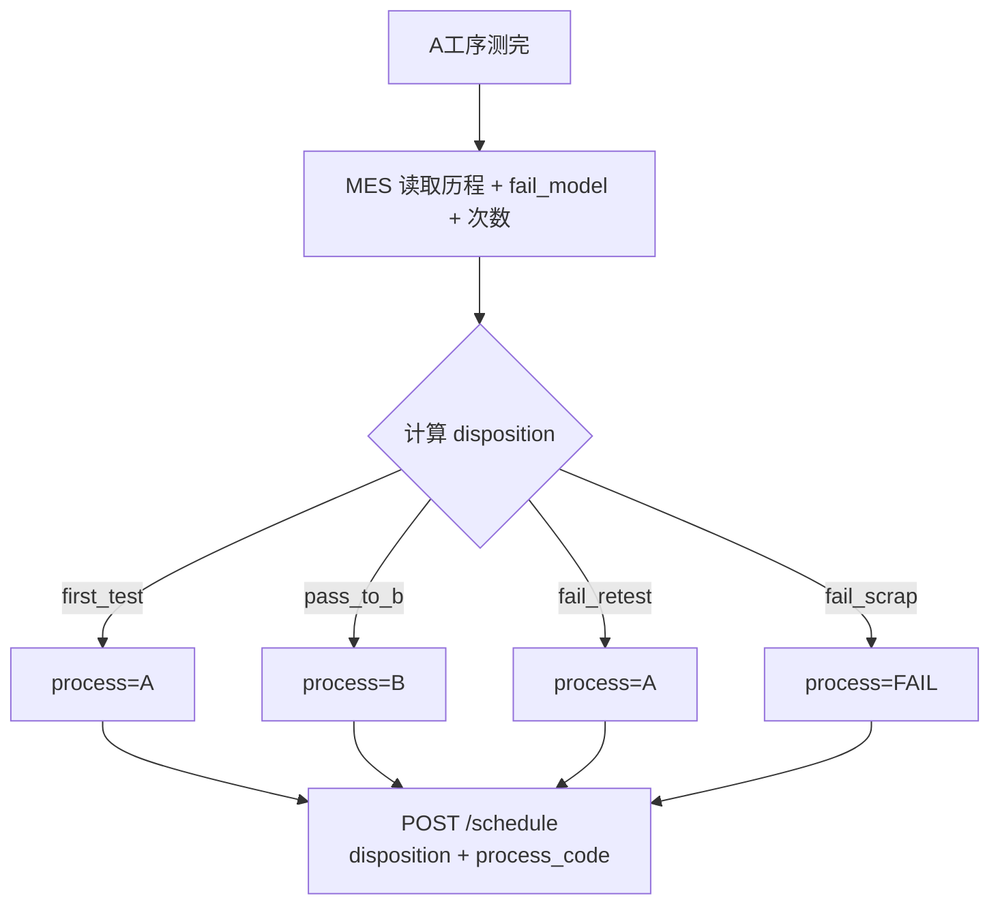
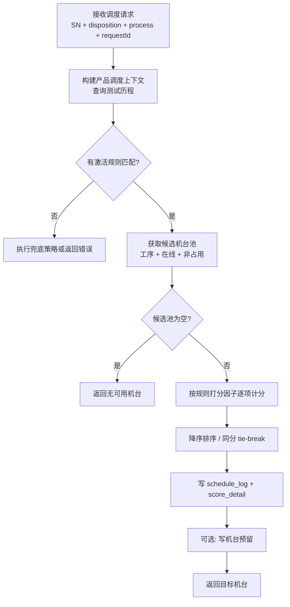

# AutoFleet 设计手册

> 自动化产线柔性机台调度服务 — 详细设计说明  
> 适用场景：Windows 11 本地部署，单线单库，WPF 配置与监控  
> PoC：WinForms Demo 见 [demo.md](./demo.md)、[策略配置指南](./策略配置指南.md)  
> MES 对接：[MES对接说明](./MES对接说明.md)

---

## 1. 项目概述

### 1.1 目标

AutoFleet 在 **A 工序测完成**（或首测进站）后，根据**产品 SN**、**下一工序**（由 MES/搬运按 pass/fail/报废策略推导）与测试历程，在候选机台中自动选出最优机台，并完整记录决策过程。

典型下一工序：

| 业务 | process_code |
|------|--------------|
| 首测 / A 复测 | A |
| A 通过后流转 | B |
| A 失败直接报废 | FAIL |

### 1.2 核心价值

- **配置化策略**：标签、触发条件、打分权重均可通过界面调整，避免硬编码
- **决策可追溯**：每次调度记录匹配规则、各机台打分明细
- **可扩展**：预留良率、关键参数等打分因子，分期实现
- **单线独立**：每条产线独立服务 + 独立 SQLite，运维边界清晰

### 1.3 设计原则

| 原则 | 说明 |
|------|------|
| 策略配置化 | 可变业务规则不进代码，代码只保留通用计算逻辑 |
| 简单优先 | 第一版只做加权求和、固定条件 DSL，不做脚本引擎 |
| 本地读、异步写 | 调度决策读本地库；外部状态通过 API 推送写入 |
| 调度视图 | 本地库存的是「为本线调度服务的运行态视图」，非 MES 镜像 |
| 状态硬过滤、偏好软打分 | 在线/维护等作候选池过滤；标签/良率/参数作加减分 |
| 不做处置判定 | 合格/复测/报废由 MES 决定；本系统只接收 `disposition` 并选机 |

### 1.4 非目标（第一版不做）

- 多线共用中央数据库
- 用户自定义脚本规则
- 实时机器学习选机
- 跨线统一 MES 主数据

---

## 2. 部署与边界

### 2.1 部署模型：单线单库

```
一条产线 = 一个 AutoFleet 服务实例 + 一份 SQLite 数据库
```

| 维度 | 说明 |
|------|------|
| 数据归属 | 本线机台、规则、测试历程、调度日志均在本库 |
| 规则独立 | 各线策略可不同，互不影响 |
| 备份恢复 | 按线备份 SQLite 即可 |
| 跨线协作 | 如需统一下发规则，采用 JSON 模板导入导出，不上共享库 |

### 2.2 系统边界

**本系统负责：**

- 调度规则与标签配置
- 在 MES 已定的 **disposition + process_code** 下选机（匹配规则 → 过滤候选 → 打分 → 返回机台）
- 调度日志与决策追溯
- 机台「调度视图」的维护与合并

**外部系统负责：**

- **MES**：fail model、复测次数、**disposition**（首测 / 流转 B / 复测 / 报废）及 **process_code**
- 测试设备 / MES：产品测试数据上报（pass/fail、**技术类** fail_type、关键参数）
- 机台软件 / MES：设备真实状态上报
- 搬运系统：接收调度结果并执行物理搬运

> 职责边界详见 [MES对接说明](./MES对接说明.md)。

---

## 3. 逻辑架构

### 3.1 分层结构

```
┌──────────────────────────────────────────────┐
│  WPF 客户端                                   │
│  基础配置 │ 规则配置 │ 运行监控 │ 人工状态覆盖   │
└────────────────────┬─────────────────────────┘
                     │ 本地调用 / 内网 HTTP
┌────────────────────▼─────────────────────────┐
│  AutoFleet.Api（调度与数据同步接口）            │
└────────────────────┬─────────────────────────┘
                     │
┌────────────────────▼─────────────────────────┐
│  AutoFleet.Application（调度引擎）            │
│  上下文构建 │ 规则匹配 │ 候选过滤 │ 打分 │ 日志  │
└────────────────────┬─────────────────────────┘
                     │
┌────────────────────▼─────────────────────────┐
│  AutoFleet.Infrastructure（SQLite + EF Core）│
└──────────────────────────────────────────────┘
```

### 3.2 建议解决方案结构

```
AutoFleet.sln
├── src/AutoFleet.Demo       # M0 PoC（WinForms，已完成）
├── AutoFleet.Domain          # 实体、枚举、接口
├── AutoFleet.Application     # 调度引擎、应用服务
├── AutoFleet.Infrastructure  # 数据库、仓储
├── AutoFleet.Api             # 对外 HTTP 接口
└── AutoFleet.Wpf             # 正式桌面界面
```

### 3.3 PoC 与正式项目

| 项目 | 说明 |
|------|------|
| `AutoFleet.Demo` | WinForms，写死数据，场景驱动，**已验证调度引擎** |
| `AutoFleet.Wpf` 等 | 正式五项目结构，SQLite + API + 配置界面 |

Demo 引擎逻辑迁移至 `AutoFleet.Application` 时，需保持与 [策略配置指南](./策略配置指南.md) 六场景结果一致。

---

## 4. 产线路由与核心调度流程

### 4.0 A 测完成后的路由（MES 职责）



> **下一工序与处置不是运维手选**，由 MES 在调用调度 API 前确定并传入 `disposition`。AutoFleet **不**重新计算 fail 次数或报废判定。Demo 用预设场景模拟 MES 输出。

### 4.1 调度主流程



### 4.2 调度请求入参

| 字段 | 必填 | 说明 |
|------|------|------|
| product_sn | 是 | 产品唯一序列号 |
| process_code | 是 | **下一工序**：A / B / FAIL（由 MES 决定） |
| disposition | 是 | **处置码**：`first_test` / `pass_to_b` / `fail_retest` / `fail_scrap`（由 MES 决定） |
| instrument_type | 是 | 产品 DCA 类型，如 K0000、A0001 |
| request_id | 建议 | 幂等键 |

`fail_type`（技术分类，如项点不良、通信异常）来自**最近一次测试历程**，用于 `fail_retest` 下的选机偏好，**不**用于路由/报废判定。完整 API 见 [MES对接说明 §5.3](./MES对接说明.md#53-调度选机mes-核心调用)。

### 4.3 规则匹配

- 仅考虑 `is_active = true` 的规则
- 按 `priority` 升序排列，**取第一个匹配成功的规则**
- 触发条件使用固定 JSON Schema（见 6.4 节）

### 4.4 候选机台过滤（硬条件）

1. `process_code` 与请求一致（含 **FAIL**  Fail 区机台）
2. `status = 在线`（且非 stale 降级排除，见 7.3）
3. 不在有效预留期内（若启用 `machine_reservation`）
4. WPF 人工设为「维护中」的机台排除

### 4.5 打分与决策

- 对候选机台逐台累加各项打分因子得分
- 按总分降序，取第一名
- **同分 tie-break**：`machine_code` 字典序（可配置）
- 所有项得分写入 `score_detail`，便于监控界面解释

### 4.6 异常与兜底

| 场景 | 建议行为 |
|------|----------|
| 无规则匹配 | 返回明确错误码；或走系统级默认策略（可配置） |
| 无在线机台 | 返回「无可用资源」，写日志 |
| 外部状态长期未更新 | 标 stale，按配置降权或排除 |
| 重复 request_id | 返回上次调度结果（幂等） |

---

## 5. 打分因子模型

调度主流程不变，扩展新策略时只需**新增因子类型**并在规则中配置。

### 5.1 因子类型

| factor_type | 说明 | 实现阶段 |
|-------------|------|----------|
| `tag` | 机台标签匹配加减分（DCA、良率档、负载、区域等） | M0 Demo / M1 |
| `yield` | 机台历史良率动态映射（替代静态「良率档」） | M7 |
| `parameter` | 关键参数余量/匹配偏好 | M8 |

**Demo 说明：** 当前用 **良率档=高/低** 静态标签模拟正式版的 yield 因子。

### 5.2 规则打分项表（`rule_score_item`）

首版可用现有 `rule_tag_weight`；扩展时建议统一为：

| 字段 | 类型 | 说明 |
|------|------|------|
| id | int | 主键 |
| rule_id | int | 关联规则 |
| factor_type | varchar(20) | tag / yield / parameter |
| factor_config | text | JSON，因类型而异 |
| weight_score | int | 固定分（tag 类） |
| sort_order | int | 计算顺序（可选） |

**tag 类 factor_config 示例：**

```json
{
  "tag_id": 12,
  "match_type": 1
}
```

`match_type`：1=包含加分，2=不包含加分，3=包含减分，4=不包含减分

**yield 类 factor_config 示例：**

```json
{
  "window": "last_50",
  "process_code": "A",
  "score_mode": "linear",
  "min_yield": 0.85,
  "max_yield": 0.98,
  "weight_max": 30
}
```

**parameter 类 factor_config 示例：**

```json
{
  "metric_code": "freq_offset",
  "mode": "margin_preference",
  "source": "product_last_test",
  "weight_max": 20
}
```

### 5.3 score_detail 结构

```json
{
  "product_sn": "SN001",
  "matched_rule_id": 3,
  "candidates": [
    {
      "machine_id": 5,
      "machine_code": "M-A-05",
      "total_score": 48,
      "items": [
        { "factor": "tag", "desc": "DCA类型=K0000", "score": 40 },
        { "factor": "tag", "desc": "良率档=高", "score": 50 }
      ]
    }
  ],
  "selected_machine_id": 5
}
```

### 5.4 扩展新因子 checklist

1. 在 `factor_type` 枚举中新增类型
2. 实现对应计分逻辑（Application 层 + 单元测试）
3. WPF 规则编辑器增加配置表单
4. 更新 `score_detail` 中 item 结构说明
5. 补充设计文档与 API 说明

---

## 6. 数据库设计

SQLite 本地库，按单线部署。以下为完整表清单：首版表 + 扩展预留表。

### 6.1 机台基础表（`machine`）

| 字段 | 类型 | 说明 |
|------|------|------|
| id | int | 主键 |
| machine_code | varchar(50) | 机台唯一编码 |
| machine_name | varchar(100) | 机台名称 |
| process_code | varchar(50) | 所属工序：A、B、**FAIL**（Fail 区） |
| process_name | varchar(50) | 所属工序名称 |
| status | int | 0=离线 1=在线 2=维护中 |
| status_source | varchar(20) | vendor / manual / schedule / inferred |
| status_updated_at | datetime | 状态最后更新时间 |
| create_time | datetime | 创建时间 |
| update_time | datetime | 更新时间 |

> **设备态**与**调度态**分离：本表承载设备态；预留见 `machine_reservation`。

### 6.2 标签定义表（`tag_def`）

示例维度（与 Demo 一致）：

| tag_dimension | tag_value | 说明 |
|---------------|-----------|------|
| DCA类型 | K0000、A0001 | 仪表 DCA 分类 |
| 良率档 | 高、低 | Demo 静态；正式版可改为 snapshot 驱动 |
| 负载 | 空闲 | 机台负载偏低 |
| 区域 | Fail区 | Fail 区接收 |
| 标记 | 刚测失败 | 运行时动态（换机场景） |

| 字段 | 类型 | 说明 |
|------|------|------|
| id | int | 主键 |
| tag_dimension | varchar(50) | 标签维度 |
| tag_value | varchar(50) | 标签值 |
| tag_desc | varchar(200) | 描述 |
| create_time | datetime | 创建时间 |

### 6.3 机台-标签关联表（`machine_tag_rel`）

| 字段 | 类型 | 说明 |
|------|------|------|
| id | int | 主键 |
| machine_id | int | 机台 ID |
| tag_id | int | 标签 ID |

### 6.4 调度规则表（`schedule_rule`）

| 字段 | 类型 | 说明 |
|------|------|------|
| id | int | 主键 |
| rule_code | varchar(50) | 规则编码 |
| rule_name | varchar(100) | 规则名称 |
| trigger_condition | text | 触发条件 JSON |
| is_active | bool | 是否启用 |
| priority | int | 优先级，越小越高 |
| create_time | datetime | 创建时间 |
| update_time | datetime | 更新时间 |

**触发条件 JSON Schema：**

**路由类规则（以 disposition 为主）：**

```json
{
  "logic": "AND",
  "conditions": [
    { "field": "disposition", "op": "eq", "value": "fail_retest" },
    { "field": "current_process", "op": "eq", "value": "A" }
  ]
}
```

**复测选机偏好（fail_type 仅用于 fail_retest）：**

```json
{
  "logic": "AND",
  "conditions": [
    { "field": "disposition", "op": "eq", "value": "fail_retest" },
    { "field": "fail_type", "op": "eq", "value": "通信异常" }
  ]
}
```

支持运算符：`eq`、`ne`、`in`、`not_in`。  
上下文可用字段：`disposition`、`current_process`、`last_test_result`、`fail_type`、`instrument_type` 等。  
WPF 规则编辑器只允许按 Schema 生成 JSON，避免自由文本配错。

> 当前 Demo 仍用 `last_test_result` + `fail_type=直接报废` 模拟路由；正式版改为 `disposition`，见 [MES对接说明 §8](./MES对接说明.md#8-与当前-demo-的差异)。

### 6.5 规则打分项表（`rule_score_item`）

首版可沿用 `rule_tag_weight`（仅 tag）；扩展期迁移为本表。

| 字段 | 类型 | 说明 |
|------|------|------|
| id | int | 主键 |
| rule_id | int | 规则 ID |
| factor_type | varchar(20) | tag / yield / parameter |
| factor_config | text | 因子配置 JSON |
| weight_score | int | 固定权重（tag 用） |

### 6.6 产品测试历程表（`product_test_history`）

| 字段 | 类型 | 说明 |
|------|------|------|
| id | int | 主键 |
| product_sn | varchar(50) | 产品 SN |
| process_code | varchar(50) | 工序编码 |
| machine_id | int | 测试机台 |
| test_result | int | 0=fail 1=pass |
| fail_type | varchar(50) | 失效**技术分类**（项点不良、通信异常等；不含「直接报废」） |
| test_time | datetime | 测试时间 |

**索引建议：** `(product_sn, test_time)`

### 6.7 调度日志表（`schedule_log`）

| 字段 | 类型 | 说明 |
|------|------|------|
| id | int | 主键 |
| product_sn | varchar(50) | 产品 SN |
| disposition | varchar(30) | MES 传入的处置码 |
| process_code | varchar(50) | 请求的下一工序 |
| request_id | varchar(50) | 幂等请求 ID |
| matched_rule_id | int | 命中规则 |
| target_machine_id | int | 目标机台 |
| score_detail | text | 打分明细 JSON |
| schedule_time | datetime | 调度时间 |

**索引建议：** `(schedule_time)`、`(product_sn)`

### 6.8 机台预留表（`machine_reservation`，可选）

| 字段 | 类型 | 说明 |
|------|------|------|
| id | int | 主键 |
| machine_id | int | 机台 ID |
| product_sn | varchar(50) | 关联产品 |
| reserved_until | datetime | 预留过期时间 |
| create_time | datetime | 创建时间 |

### 6.9 扩展表（M3/M4）

**机台指标快照（`machine_metric_snapshot`）— 良率**

| 字段 | 类型 | 说明 |
|------|------|------|
| id | int | 主键 |
| machine_id | int | 机台 |
| process_code | varchar(50) | 工序（可空） |
| window_type | varchar(20) | last_n / last_7d / all |
| pass_count | int | 通过数 |
| total_count | int | 总数 |
| yield_rate | decimal | 良率 |
| updated_at | datetime | 更新时间 |

**产品测试参数（`product_test_metric`）— 关键参数**

| 字段 | 类型 | 说明 |
|------|------|------|
| id | int | 主键 |
| product_sn | varchar(50) | 产品 SN |
| process_code | varchar(50) | 工序 |
| machine_id | int | 机台 |
| metric_code | varchar(50) | 参数编码 |
| metric_value | decimal | 实测值 |
| spec_min | decimal | 规格下限（可空） |
| spec_max | decimal | 规格上限（可空） |
| test_time | datetime | 测试时间 |

---

## 7. 机台状态与外部集成

### 7.1 两类状态

| 类型 | 存储 | 主要写入方 |
|------|------|------------|
| 设备态 | `machine.status` | 外部 API、WPF 人工 |
| 调度态 | `machine_reservation` | 调度服务、搬运回执 |

**调度时不应作为主要手段写入设备态**；调度只写日志与预留。

### 7.2 调度视图合并优先级

1. WPF 人工「维护中」 — 最高
2. 有效调度预留 — 次高
3. 外部 API 上报 — 默认来源
4. 长期无更新（stale）— 按配置降权或排除

### 7.3 状态过期（stale）

- 若 `status_updated_at` 超过配置阈值（如 10 分钟）未更新，标记 stale
- 策略可配：仍参与打分但告警 / 排除出候选池 / 仅 WPF 提示

### 7.4 外部 API 约定（摘要）

完整接口、时序与 MES 侧 fail model 说明见 **[MES对接说明](./MES对接说明.md)**。

| 接口 | 调用方 | 用途 |
|------|--------|------|
| `POST /api/products/{sn}/test-records` | 测试设备 / MES | 上报 pass/fail、技术类 fail_type |
| `PUT /api/machines/{code}/status` | MES / 机台软件 | 机台在线/维护状态 |
| `POST /api/schedule` | **MES** | 传入 disposition + process_code，获取目标机台 |
| `GET /api/health` | 运维 / MES | 探活 |

**调度请求示例：**

```json
{
  "product_sn": "SN-20001",
  "process_code": "A",
  "disposition": "fail_retest",
  "instrument_type": "K0000",
  "request_id": "550e8400-e29b-41d4-a716-446655440000"
}
```

外部推送采用**异步写本地库**；`POST /schedule` **只读本地**，不实时依赖外部系统，避免强耦合。

---

## 8. WPF 界面模块

### 8.1 基础数据配置

- **机台管理**：列表、增删改、多选绑定标签、状态来源与时间展示
- **标签管理**：按维度分组、增删标签、删除前检查引用

### 8.2 调度规则配置

- **规则列表**：名称、优先级、启停、编辑删除
- **规则编辑**：
  - 基础信息与优先级
  - 触发条件（可视化表单 → JSON）
  - 打分项配置（标签 / 良率 / 参数，按阶段开放）
  - JSON 预览
  - **模拟调度**：按业务场景或 SN，展示下一工序、命中规则与各机台得分（参考 Demo）

### 8.3 运行监控

- **激活策略总览**：当前生效规则卡片
- **调度日志看板**：时间倒序，可展开 score_detail
- **机台状态看板**：状态、来源、标签、stale 告警
- **服务状态**：API 是否可用、最近错误

---

## 9. 扩展指南

### 9.1 无需改代码即可扩展

- 新增标签维度 → 标签管理 + 机台绑定 + 规则权重
- 新增调度场景 → 新增规则 + 触发条件 + 打分项
- 规则启停 → 立即生效（内存缓存 + 变更刷新）

### 9.2 需要开发即可扩展

- 新增 `factor_type`（如负载均衡、最近最少使用）
- 新增触发条件字段（在上下文构建中补充）
- 规则模板导入导出

### 9.3 后续分析能力

基于 `schedule_log` 与测试历程，可离线分析：

- 不同规则下的重测通过率
- 机台分配与良率相关性
- 辅助人工调优权重（非自动 ML）

---

## 10. 技术选型

| 类别 | 选型 |
|------|------|
| 运行时 | .NET 8 |
| PoC UI | WinForms（`AutoFleet.Demo`，已完成） |
| 正式 UI | WPF + MVVM |
| 数据库 | SQLite + EF Core |
| API | ASP.NET Core Web API |
| 日志 | Serilog（文件 + 可选入库） |

---

## 11. 术语表

| 术语 | 说明 |
|------|------|
| 工序 | 测试阶段：A、B；**FAIL** 表示 Fail 区（报废接收） |
| DCA类型 | 仪表产品分类，如 K0000、A0001 |
| 良率档 | Demo 静态标签；正式版由 yield 因子动态计算 |
| disposition | MES 处置码：首测 / 流转 B / 复测 / 报废 |
| 下一工序 | `process_code`，由 MES 与 disposition 一并决定 |
| 调度视图 | 本系统维护的、用于选机决策的机台运行态 |
| 打分因子 | 对候选机台加减分的维度（标签、良率等） |
| 单线单库 | 一条产线对应一个服务实例与一份数据库 |

---

## 12. 相关文档

- [架构介绍](./架构介绍.md)
- [MES对接说明](./MES对接说明.md)
- [策略配置指南](./策略配置指南.md)
- [开发计划](./开发计划.md)
- [Demo 说明](./demo.md)

---

*文档版本：v1.2 | 明确 MES 处置边界 + disposition 入参*
